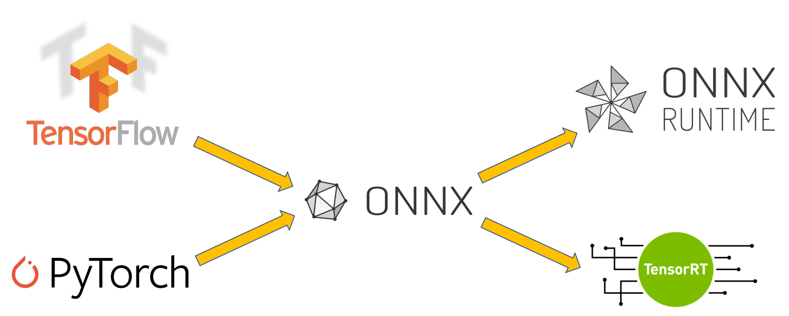
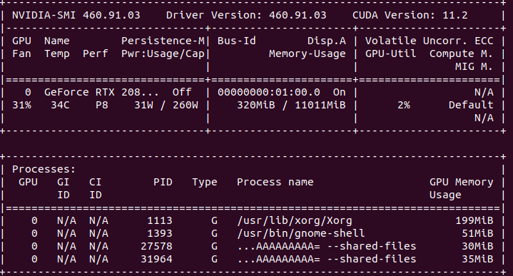
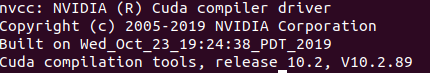
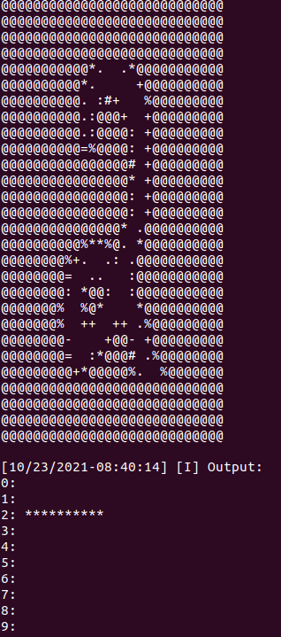

# Introduction

Neural networks are usually designed and trained by frameworks like Tensorflow, Pytorch and deployed by TensorRT to achieve better inference runtime. The Tensorflow models and Pytorch models need to be firstly converted to ONNX model and then to TensorRT model. ONNX also has its runtime library ONNXRuntime.  

This repository contains some code during my study on:  
1. Conversion from Tensorflow to ONNX  
2. Conversion from Pytorch to ONNX
3. Installation of Netron(visualize networks), Nvidia driver, CUDA, cuDNN, TensorRT, onnx2TensorRT
4. Conversion from ONNX to TensorRT
5. Inference on ONNXRuntime
5. Inference on TensorRT

# Installation

## 0. Clone the repository
```bash
git clone https://github.com/MingyuLi19910814/ONNX-TensorRT.git
## This two lines are crutial!
cd ONNX-TensorRT
git submodule update --init --recursive
```

## 1. Install nvidia driver if it's not installed yet
```bash
sudo apt update
sudo apt upgrade
sudo apt install nvidia-drvier-460
reboot
```
Verify the installation:
```bash
nvidia-smi
```
Expected output:  


## 2. Install cuda 10.2
```bash
cd ~/Downloads
wget https://developer.download.nvidia.com/compute/cuda/10.2/Prod/local_installers/cuda_10.2.89_440.33.01_linux.run
chmod +x cuda_10.2.89_440.33.01_linux.run
sudo ./cuda_10.2.89_440.33.01_linux.run
echo "export PATH=\${PATH}:/usr/local/cuda-10.2/bin" >> ~/.bashrc
echo "export LD_LIBRARY_PATH=\${LD_LIBRARY_PATH}:/usr/local/cuda-10.2/lib64" >> ~/.bashrc
source ~/.bashrc
rm cuda_10.2.89_440.33.01_linux.run
```

Verify the installation:
```bash
nvcc --version
```
Expected output:  


## 3. Install CUDA 10.2 Patchs
You need to downloaded the two patches of CUDA 10.2 to avoid the issue in cuBLAS library from [here](https://developer.nvidia.com/cuda-10.2-download-archive?target_os=Linux&target_arch=x86_64&target_distro=Ubuntu&target_version=1804&target_type=runfilelocal) to ~/Downloades
```bash
cd ~/Downloades
chmod +x cuda_10.2.1_linux.run
chmod +x cuda_10.2.2_linux.run
sudo ./cuda_10.2.1_linux.run
sudo ./cuda_10.2.2_linux.run
```

## 4. Install cuDNN 8.2.4 for CUDA 10.2
```bash
cd ~/Downloads
```
Download cuDNN library from https://developer.nvidia.com/compute/machine-learning/cudnn/secure/8.2.4/10.2_20210831/cudnn-10.2-linux-x64-v8.2.4.15.tgz  to ~/Downloads
```bash
cd ~/Downloads
tar -xzvf cudnn-10.2-linux-x64-v8.2.4.15.tgz
sudo cp cuda/include/cudnn*.h /usr/local/cuda/include 
sudo cp -P cuda/lib64/libcudnn* /usr/local/cuda/lib64 
sudo chmod a+r /usr/local/cuda/include/cudnn*.h /usr/local/cuda/lib64/libcudnn*
rm cudnn-10.2-linux-x64-v8.2.4.15.tgz
rm -rf ./cuda
```

## 5. Install TensorRT 8.2 EA
Download corresponding TensorRT8 version of your os and architecture from https://developer.nvidia.com/nvidia-tensorrt-8x-download to ~/Downloads. This document uses [TensorRT 8.2 EA for Linux x86_64 and CUDA 10.2 TAR Package](https://developer.nvidia.com/compute/machine-learning/tensorrt/secure/8.2.0/tars/tensorrt-8.2.0.6.linux.x86_64-gnu.cuda-10.2.cudnn8.2.tar.gz)
```bash
cd ~/Downloads
# set your preferred installation directory
TAR_DIR=/usr/local
tar xzvf TensorRT-8.2.0.6.Linux.x86_64-gnu.cuda-10.2.cudnn8.2.tar.gz
sudo mv TensorRT-8.2.0.6 $TAR_DIR
echo "export LD_LIBRARY_PATH=\${LD_LIBRARY_PATH}:${TAR_DIR}/TensorRT-8.2.0.6/lib" >> ~/.bashrc
cd $TAR_DIR/TensorRT-8.2.0.6/python
# select the whl of your python version. This document uses py 3.8
python3 -m pip install tensorrt-8.2.0.6-cp38-none-linux_x86_64.whl
cd ../uff
python3 -m pip install uff-0.6.9-py2.py3-none-any.whl
cd ../graphsurgeon/
python3 -m pip install graphsurgeon-0.4.5-py2.py3-none-any.whl
cd ../onnx_graphsurgeon
python3 -m pip install onnx_graphsurgeon-0.3.12-py2.py3-none-any.whl
```

Verify the installation
```bash
TAR_DIR=/usr/local
cd $TAR_DIR/TensorRT-8.2.0.6/samples/sampleMNIST
make
cd ../../bin
./sample_mnist
```
Expected output:  


## 6. Install onnx2tensorRT

### 6.1 Install CMake
```bash
sudo apt purge --auto-remove cmake
wget -O - https://apt.kitware.com/keys/kitware-archive-latest.asc 2>/dev/null | gpg --dearmor - | sudo tee /etc/apt/trusted.gpg.d/kitware.gpg >/dev/null
# Ubuntu 20.04
sudo apt-add-repository 'deb https://apt.kitware.com/ubuntu/ focal main'     
# Ubuntu 18.04
sudo apt-add-repository 'deb https://apt.kitware.com/ubuntu/ bionic main'
# Ubuntu 16.04
sudo apt-add-repository 'deb https://apt.kitware.com/ubuntu/ xenial main'

sudo apt update
sudo apt install cmake
```
### 6.2 Install Protobuf
```bash
sudo apt-get install libprotobuf-dev protobuf-compiler
```
### 6.3 Install onnx2tensorRT
```bash
PATH_TO_TRT='/usr/local/TensorRT-8.2.0.6/include'
cd TensorRT/ONNX2TensorRT/onnx-tensorrt
mkdir build && cd build
cmake .. -DTENSORRT_ROOT=$PATH_TO_TRT && make -j
sudo make install
echo "export LD_LIBRARY_PATH=${PWD}:\${LD_LIBRARY_PATH}" >> ~/.bashrc
```