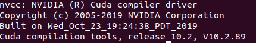

# Install nvidia driver if it's not installed yet
```bash
sudo apt update
sudo apt upgrade
sudo apt install nvidia-drvier-460
reboot
```

```bash
# verification
nvidia-smi
```
Expected output:  


# Install cuda 10.2
```bash
cd ~/Downloads
wget https://developer.download.nvidia.com/compute/cuda/10.2/Prod/local_installers/cuda_10.2.89_440.33.01_linux.run
chmod +x cuda_10.2.89_440.33.01_linux.run
sudo ./cuda_10.2.89_440.33.01_linux.run
echo "export PATH=\${PATH}:/usr/local/cuda-10.2/bin" >> ~/.bashrc
echo "LD_LIBRARY_PATH=\${LD_LIBRARY_PATH}:/usr/local/cuda-10.2/lib64" >> ~/.bashrc
source ~/.bashrc
rm cuda_10.2.89_440.33.01_linux.run
# verification
nvcc --version
```
Expected output:  



# Install cuDNN 8.2.4 for CUDA 10.2
```bash
cd ~/Downloads
```
download cuDNN library from https://developer.nvidia.com/compute/machine-learning/cudnn/secure/8.2.4/10.2_20210831/cudnn-10.2-linux-x64-v8.2.4.15.tgz  
```bash
tar -xzvf cudnn-10.2-linux-x64-v8.2.4.15.tgz
sudo cp cuda/include/cudnn*.h /usr/local/cuda/include 
sudo cp -P cuda/lib64/libcudnn* /usr/local/cuda/lib64 
sudo chmod a+r /usr/local/cuda/include/cudnn*.h /usr/local/cuda/lib64/libcudnn*
rm cudnn-10.2-linux-x64-v8.2.4.15.tgz
rm -rf ./cuda
```